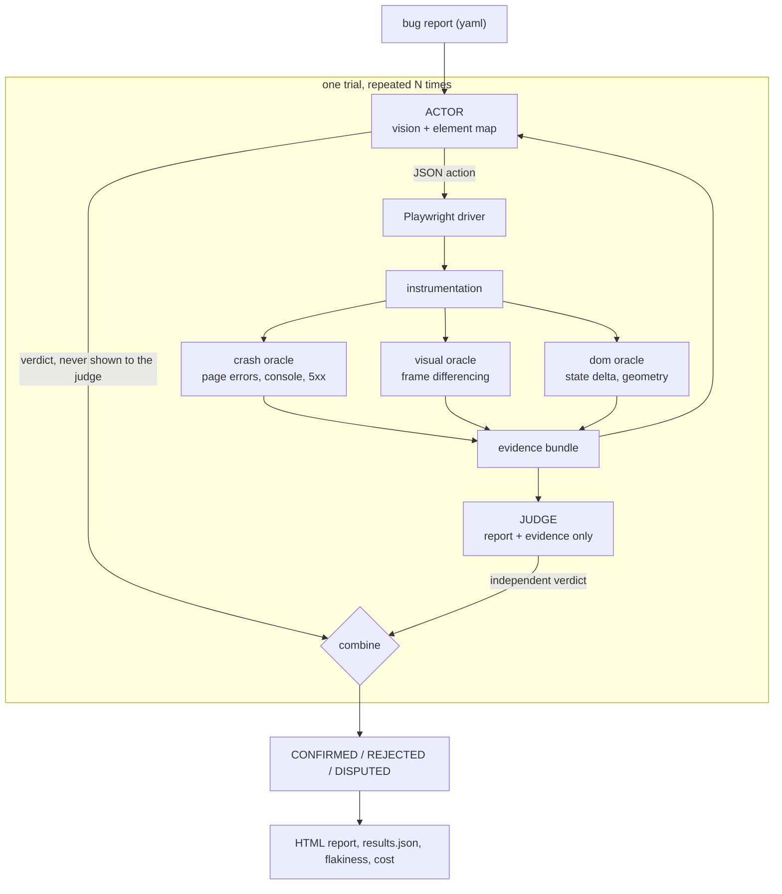

# ARBITER

**Automated Reproduction of Bugs with Independent Trial Evidence Review**

[](https://github.com/adwitiyashukla/ARBITER/actions/workflows/ci.yml)
[](LICENSE)
[](https://www.python.org/)
[](https://huggingface.co/spaces/adwitiyashukla/ARBITER)

ARBITER takes a bug report, opens a real browser, and tries to reproduce it. Then a second model
looks at the screenshots and the instrumentation logs and decides whether the bug actually
showed up. The second model never sees what the first one was thinking, so it cannot just take
the first one's word for it.

You can [try it in the browser](https://huggingface.co/spaces/adwitiyashukla/ARBITER) without
installing anything.

## Why I built this

A friend of mine works on an LLM agent that reproduces Android bug reports, and while reading
through his results I kept getting stuck on the same thing. The agent that does the clicking is
also the thing that decides whether the clicking worked. It follows the steps in the report,
nothing explodes, and it says "reproduced". But following the steps and actually seeing the bug
are two different things, and there is nothing in that setup that can tell them apart.

He handled it by auditing his own results by hand, which is the honest thing to do, but it does
not scale and it is not something the system does for you. So I wanted to try building it the
other way round: make the checking a separate component that only ever sees evidence, and see
what falls out.

Two other things bothered me about how these systems usually get evaluated:

- They run each bug once. One successful run is not really reproduction, it is one sample.
- They only test bug reports that are real. Nobody checks what happens when you hand the agent a
  report describing a bug that does not exist, which is a thing that happens constantly on real
  issue trackers.

So this version runs every report several times and reports how often it worked, and two of the
ten reports in my benchmark are deliberately wrong.

## How it works



**The actor** gets each screen two ways: as a numbered list of elements with their flags and
pixel boxes, and as the same screenshot with colour-coded boxes drawn on top, so element `#7` in
the text is something it can actually point at. It replies with one JSON action from a fixed
list of 15. The prompt tells it that running the steps is not the same as seeing the symptom,
and that some of the reports it will get are wrong.

**The judge** gets the bug report, the actions that were executed with their results, the signals
the instrumentation recorded, the final page state, and up to four raw screenshots picked around
the strongest signals. It does not get the actor's reasoning or its verdict. Its prompt tells it
to be hard to convince, and that INCONCLUSIVE is a real answer rather than a cop-out.

Then the two verdicts get combined, and this table is where the honesty actually comes from:

| actor says | judge says | outcome | counts as a reproduction |
|---|---|---|---|
| REPRODUCED | REPRODUCED | `CONFIRMED` | yes |
| REPRODUCED | NOT_REPRODUCED | `REJECTED` | no, and it gets counted as an overclaim |
| NOT_REPRODUCED | REPRODUCED | `DISPUTED` | no, but flagged so I can look at it |
| NOT_REPRODUCED | NOT_REPRODUCED | `AGREED_NOT_REPRODUCED` | no |
| anything | INCONCLUSIVE | `UNRESOLVED` | no |

### The isolation test, and the bug it found on day one

The whole thing falls apart if the actor's opinion leaks into the judge's prompt, so I wrote a
test for it (`tests/test_judge_isolation.py`). It checks two things: that the function which
builds the judge's payload has no parameter that could even carry the actor's verdict, and that
a sentinel string from the actor never shows up in the rendered text.

It failed the first time I ran it. The actor ends its run with a `finish` action, and that action
carries its verdict and its written reason as arguments, and I was passing the whole action log
to the judge. So the judge could read the actor's conclusion in the action list. The core claim
of the project had a hole in it about an hour after I wrote the core of the project. `finish` is
now stripped from everything the judge sees, and the test is in CI so it stays that way.

## The three oracles

None of these decide whether a bug was reproduced. They just report facts about what happened.
Deciding whether those facts match the report is the judge's job, and keeping that split clean
was one of the more useful design decisions I made.

**Crash oracle.** Uncaught exceptions, `console.error`, failed requests, 5xx responses. Straight
off the Playwright event stream, nothing clever.

**Visual oracle** (`arbiter/oracle/visual.py`). This is the part I had the most fun with. Around
every action the driver grabs 12 frames at roughly 80 ms with a timestamp on each. The frames get
turned to grayscale, downscaled to 320 px wide, and reduced to a list of mean absolute
differences between consecutive frames. Then:

- *no-op*: the first and last frame differ by less than 0.002, so nothing happened. This is what
  catches a button that renders fine and does nothing when you click it.
- *stepped animation*: at least two frames moved, the two busiest frames account for 60% or more
  of all the pixel change, and fewer than half the frame pairs moved at all. A real CSS transition
  spreads its change out evenly and scores around 0.2 on that concentration measure. A
  hand-rolled `setTimeout` animation dumps everything into two or three frames and scores above
  0.8. The DOM looks identical in both cases, which is why a DOM-only tool cannot see this class
  of bug at all.
- *instant change*: exactly one frame moved. I specifically do **not** flag this as jank, because
  a UI update that was never animated is not an animation bug. This took me a couple of tries to
  get right, and it has its own test, because a jank detector that fires on every instant update
  is useless.
- *capture stall*: the gap between two screenshots blew past 250 ms, which usually means the page
  blocked the main thread.

**DOM oracle.** A readable diff of the element map before and after each action (what appeared,
what vanished, what text or value or disabled state changed), plus geometry checks for pinned
elements sitting on top of content. Ancestors and containment are excluded so a header does not
get reported for covering its own logo.

## The benchmark

Ten bug reports against ten small web apps that I wrote, served from a local static server so the
whole thing runs offline and cannot break because some website changed. Each app has exactly one
planted defect. The agent never sees the source, only the rendered DOM, the screenshots and the
issue text.

Planting the bugs yourself is the normal approach for this kind of evaluation (Defects4J and
BugsInPy both work this way), and it is the only way to have exact ground truth. It also makes
things easier than the real world, which I say again in the limitations.

| report | category | what is wrong | ground truth |
|---|---|---|---|
| `todo-crash` | crash | null dereference once the list empties | bug |
| `modal-close` | unresponsive control | handler on the wrong node, so the X renders but does nothing | bug |
| `drawer-jank` | animation jank | timer-based animation that jumps and blocks the main thread | bug |
| `contact-residue` | state residue | typed fragment left behind next to the contact chip | bug |
| `export-disabled` | disabled control | wrong selector, so four dropdowns never unlock | bug |
| `stepper-skip` | logic | off-by-one, quantity goes 2 then 4 | bug |
| `double-submit` | race condition | no in-flight guard, so a double click files twice | bug |
| `header-overlap` | responsive layout | hard-coded spacer under a header that wraps when narrow | bug |
| `search-filter-ok` | **negative control** | nothing at all. The filter is correctly case-insensitive | no bug |
| `theme-persist-ok` | **negative control** | nothing at all. The theme survives switching tabs | no bug |

The two controls are the part I am most glad I included. Their reports confidently describe
symptoms that are not there, and an agent that wants to be helpful will happily go and find them.
If it "reproduces" one of those, that is a false positive and it counts against the score.

The bug categories are not invented either. Residual text sitting next to a committed contact
chip, controls that render but stay permanently disabled, a fixed header colliding with content
on a narrow screen: these are all shapes I found while reading through real issue trackers.

## Results

<!-- RESULTS:START -->
Actor `gemini-3.5-flash-lite`, judge `gemini-3.5-flash-lite`, 3 trial(s) per report.

The verdicts here were produced on 2026-08-03 08:21:11 in a second pass over the evidence the benchmark run had already saved. Nothing was re-run in the browser and no actor output was regenerated, so the judge saw exactly the screenshots, actions and signals from the original run. Actor and judge ended up on the same base model, which the free tier forced. The judge still cannot see the actor's reasoning, and the audit below is my attempt to check whether that is enough.

| metric | value |
|---|---|
| seeded bugs reproduced | **8 / 8** (100%) |
| false positives on negative controls | **0 / 2** |
| overall accuracy against ground truth | **100%** |
| trials run | 30 |
| trials where the actor claimed a reproduction | 24 |
| of those, confirmed by the independent judge | 24 |
| rejected by the judge as unproven | 0 (0% of claims) |
| claimed but never confirmed | 0 (0% of claims) |
| judge overruled a negative actor verdict | 0 |
| inconclusive | 0 |
| reports reproducing in every trial | 8 |
| model calls | 102 |
| tokens in / out | 269,938 / 10,071 |
| cost at paid-tier rates | $0.1062 |
| total trial time | 3085s across 30 trials |

The judge did not reject any of the 24 claims the actor made, so on this benchmark the actor never overclaimed. That is a nice result and also a gap in the evidence, which is what the audit below is for.

### Per report

| report | category | ground truth | verdict | reproduced in | stability | actor claimed / judge confirmed |
|---|---|---|---|---|---|---|
| `contact-residue` | state-residue | bug | reproduced (correct) | 3/3 | deterministic | 3 / 3 |
| `double-submit` | race-condition | bug | reproduced (correct) | 3/3 | deterministic | 3 / 3 |
| `drawer-jank` | animation-jank | bug | reproduced (correct) | 3/3 | deterministic | 3 / 3 |
| `export-disabled` | disabled-control | bug | reproduced (correct) | 3/3 | deterministic | 3 / 3 |
| `header-overlap` | responsive-layout | bug | reproduced (correct) | 3/3 | deterministic | 3 / 3 |
| `modal-close` | unresponsive-control | bug | reproduced (correct) | 3/3 | deterministic | 3 / 3 |
| `search-filter-ok` | negative-control | control, no bug | not reproduced (correct) | 0/3 | never | 0 / 0 |
| `stepper-skip` | logic | bug | reproduced (correct) | 3/3 | deterministic | 3 / 3 |
| `theme-persist-ok` | negative-control | control, no bug | not reproduced (correct) | 0/3 | never | 0 / 0 |
| `todo-crash` | crash | bug | reproduced (correct) | 3/3 | deterministic | 3 / 3 |
<!-- RESULTS:END -->

The full report, with every trial's judge reasoning and the screenshots each verdict was based
on, is at [adwitiyashukla.github.io/ARBITER](https://adwitiyashukla.github.io/ARBITER/).

Nothing in this section is typed by hand. `tools/inject_results.py` regenerates it from the run
artifacts, so the README cannot quietly drift away from the data.

### Auditing the judge

<!-- AUDIT:START -->
A judge that agrees with everything is worth nothing, so this check hands it the evidence from one bug together with a **different** bug's report, which that evidence cannot possibly support. Judge model `gemini-3.5-flash-lite`.

**8 of 8 mismatched pairs correctly refused.**

| evidence from | judged against | verdict | outcome |
|---|---|---|---|
| `contact-residue` | `double-submit` | NOT_REPRODUCED | correctly refused |
| `double-submit` | `drawer-jank` | NOT_REPRODUCED | correctly refused |
| `drawer-jank` | `export-disabled` | NOT_REPRODUCED | correctly refused |
| `export-disabled` | `header-overlap` | NOT_REPRODUCED | correctly refused |
| `header-overlap` | `modal-close` | INCONCLUSIVE | correctly refused |
| `modal-close` | `stepper-skip` | NOT_REPRODUCED | correctly refused |
| `stepper-skip` | `todo-crash` | NOT_REPRODUCED | correctly refused |
| `todo-crash` | `contact-residue` | NOT_REPRODUCED | correctly refused |
<!-- AUDIT:END -->

I added this because I realised my results did not actually prove the judge was doing anything.
It confirmed all 24 of the actor's claims, and a judge that agrees with everything is worth
exactly nothing. So this check feeds it the evidence from one bug together with a completely
different bug's report and sees whether it notices. It costs one model call per bug and reuses
evidence that is already on disk.

## Running it yourself

```bash
git clone https://github.com/adwitiyashukla/ARBITER.git
cd ARBITER
pip install -r requirements.txt
python -m playwright install chromium

cp .env.example .env      # paste a free Gemini key from https://aistudio.google.com/apikey
```

Before spending any tokens, check the machine. This drives three of the benchmark apps with
hard-coded clicks and asserts that every oracle fires, and it needs no API key:

```bash
python -m arbiter smoke
```

Then check the model wiring and run the benchmark:

```bash
python -m arbiter check
python -m arbiter run --trials 3 --record
```

| flag | what it does |
|---|---|
| `--only todo-crash,drawer-jank` | run a subset |
| `--trials N` | how many times to repeat each report, which is what gives you the flakiness score |
| `--headed` | watch the browser do it |
| `--video` | save a webm of each trial |
| `--rpm 8` | slow the requests down to stay under a free tier limit |
| `--record` | save every model exchange to `traces/` so the run can be replayed later |
| `--provider mock` | replay `traces/` with no key and no network |
| `--judge-model gemini-3.1-pro-preview` | a stronger, different judge |

The actor defaults to `gemini-3.5-flash-lite` and the judge to `gemini-3.5-flash`, both free
tier. The actor makes roughly ten calls per trial and the judge exactly one, so the actor sits on
whichever model has the most headroom. If you have credit somewhere, pointing `--judge-provider`
at a different vendor makes the whole thing stronger and needs no code change.

Free tiers throttle hard, which I found out the annoying way, so `--rpm` paces the requests from
the client side instead of only backing off after a 429. There is also a circuit breaker: after
three calls in a row exhaust their retries it stops and tells you, rather than grinding through
backoff for twenty minutes.

Because the judging is separate from the acting, two commands work on evidence that is already
saved and never touch the browser:

```bash
python -m arbiter rejudge --all --record   # review saved evidence again, or with another model
python -m arbiter judge-audit              # the mismatched-report check above
```

## Replaying my run with no API key

`--record` writes every request and reply into `traces/`, so anyone can replay the exact run:

```bash
python -m arbiter run --provider mock --trials 1
```

CI does this on every push, which means the whole pipeline gets exercised on a clean machine with
no secrets, and my published numbers can be re-derived instead of taken on trust.

## Things I know are wrong with it

A results table without this section is not worth much, so:

- **I planted the bugs myself.** That gives exact ground truth and a suite that runs offline, and
  it also makes the job easier than the real world. It measures whether the pipeline works, not
  where its ceiling is.
- **The judge is still a language model.** It can be wrong in either direction. What I can claim
  is that it is independent and has to point at evidence, not that it is right.
- **The judge rejected nothing on my run.** The actor never overclaimed on this benchmark, so I
  have no live example of the rejection path firing on real actor output. That path has unit
  tests, and the mismatched-report audit is the closest thing I have to live evidence that the
  judge discriminates. Getting a real overclaim rate needs a harder benchmark than mine.
- **Actor and judge ended up on the same base model.** Free tier quotas forced it. The separation
  that does the work here is informational rather than architectural, since the judge still
  cannot see the actor's reasoning, and the audit is what tests whether that holds. Fixing it is
  one flag if you have credit.
- **The acting and the judging happened in two passes.** The benchmark run drove the browser and
  saved evidence, then the judging model hit its daily quota partway through, so I finished the
  verdicts afterwards with `arbiter rejudge --all` over the exact evidence the run had captured.
  No actor output was regenerated and no browser was re-driven. It turned out to be a decent
  advertisement for keeping evidence durable, but it was not the plan.
- **Ten reports is small.** The percentages have wide error bars. The infrastructure scales to
  more cases, writing the cases is the actual work.
- **The overlap signal is the noisiest of the three.** You can see it in the published report: on
  `drawer-jank` the DOM oracle reports the open drawer covering the button behind it, which is
  what an open drawer is supposed to do. Backdrops covering more than 60% of the viewport are
  already excluded, but a partial overlay still trips it. It never changed a verdict, because the
  judge weighs signals against the report rather than treating any one of them as proof, but it
  is a false signal source and a stricter rule is on my list.
- **No cross-origin or login flows.** Out of scope, same limitation the Android papers report.
- **The cost figures use paid-tier prices** from Google's pricing page as of 2026-08-02, even
  though I ran it on the free tier. The token counts come from the API usage data and are exact.
  The dollar number is what that traffic would have cost if I had been billed.

## What I would do next

The obvious one is to stop planting bugs and point it at real GitHub issues from a live
open-source web app. That is where the judge would finally get a chance to reject something, and
where the reproduction rate would mean a lot more than it does here. After that, tightening the
overlap rule, and emitting a replayable test script for every confirmed reproduction so the
output is a regression test rather than a log.

## Where the idea came from

- Wang, Zhao, Feng, Zhang, Halfond, Chen, Sun, Shi and Yu, *Feedback-Driven Automated Whole Bug
  Report Reproduction for Android Apps* (ReBL), ISSTA 2024. The section on why their
  reproductions failed is what pointed me at the two gaps I went after: UI elements the
  accessibility hierarchy cannot see, and non-crash symptoms subtle enough that an agent declares
  success without ever having looked at them.
- Feng and Chen, *Prompting Is All You Need: Automated Android Bug Replay with Large Language
  Models* (AdbGPT), ICSE 2024.
- Just, Jalali and Ernst, *Defects4J*, ISSTA 2014, for how seeded-bug benchmarks are normally
  built.

Those are Android, this is web, so none of my numbers should be read against theirs. They shaped
the design, they are not baselines.

## License

MIT, see [LICENSE](LICENSE).
