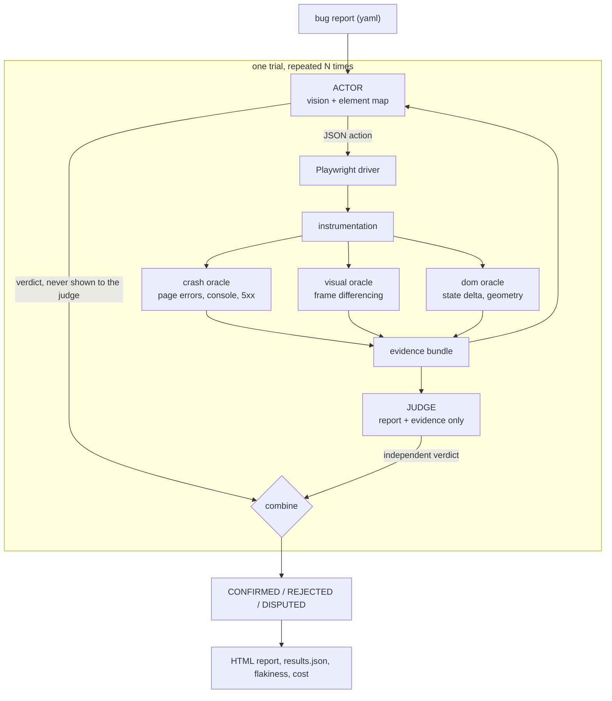

# ARBITER

Automated Reproduction of Bugs with Independent Trial Evidence Review

[](https://github.com/adwitiyashukla/ARBITER/actions/workflows/ci.yml)

ARBITER reads a bug report, opens a real browser and tries to reproduce it. Then a second model
looks at the screenshots and the instrumentation logs and decides whether the bug actually showed
up. The second model never sees what the first one was thinking, so it cannot just take the first
one's word for it.

There is a live demo at https://huggingface.co/spaces/adwitiyashukla/ARBITER that needs no install
and no API key, and the full report from my run is at https://adwitiyashukla.github.io/ARBITER/.

## How the two halves work



### The actor

The actor gets each screen two ways. One is a numbered list of up to 60 visible elements with their
flags and pixel boxes. The other is the same screenshot with colour coded boxes drawn on top, so
element `#7` in the text is something it can actually point at. It replies with one JSON action
from a fixed list of 15, and the parser rejects anything that is not in that list or is missing an
argument. Its prompt tells it that running the steps is not the same as seeing the symptom, and
that some of the reports it will get are wrong.

### The judge

The judge gets the bug report, the actions that were executed with their result strings, the
signals the instrumentation recorded, the final page state, and up to four raw screenshots picked
around the strongest signals. It does not get the actor's reasoning or its verdict. Its prompt
tells it to be hard to convince, and that INCONCLUSIVE is a real answer rather than a way out.

The screenshots it sees are the raw ones, not the annotated ones. The overlay exists to help the
actor address elements, and showing the judge a pre-interpreted view of the screen would drag the
actor's framing into what is supposed to be a fresh look.

### Combining them

| actor says | judge says | outcome | counts as a reproduction |
|---|---|---|---|
| REPRODUCED | REPRODUCED | `CONFIRMED` | yes |
| REPRODUCED | NOT_REPRODUCED | `REJECTED` | no, and it is counted as an overclaim |
| NOT_REPRODUCED | REPRODUCED | `DISPUTED` | no, but flagged so I can look at it |
| NOT_REPRODUCED | NOT_REPRODUCED | `AGREED_NOT_REPRODUCED` | no |
| anything | INCONCLUSIVE | `UNRESOLVED` | no |

A report counts as reproduced when a strict majority of its trials are confirmed, so 2 of 3 is a
reproduction and 1 of 2 is not.

## The three oracles

None of these decide whether a bug was reproduced. They report facts about what happened. Deciding
whether those facts match the report is the judge's job, and keeping that split clean was one of
the more useful decisions I made.

### Crash oracle

Uncaught exceptions, `console.error`, failed requests, 5xx responses. Straight off the Playwright
event stream, nothing clever.

### Visual oracle

This is the part I had the most fun with. Around every action the driver grabs 12 frames at roughly
80 ms with a timestamp on each. The frames get turned to grayscale, downscaled to 320 px wide, and
reduced to a list of mean absolute differences between consecutive frames. From that:

- No-op: the first and last frame differ by less than 0.002, so nothing happened. This is what
  catches a button that renders fine and does nothing when you click it.
- Stepped animation: at least two frames moved, the two busiest frames account for 60 percent or
  more of all the pixel change, and fewer than half the frame pairs moved at all. A real CSS
  transition spreads its change out evenly and scores around 0.2 on that concentration measure. A
  hand rolled `setTimeout` animation dumps everything into two or three frames and scores above
  0.8. The DOM looks identical in both cases, which is why a DOM-only tool cannot see this class of
  bug at all.
- Instant change: exactly one frame moved, and I deliberately do not flag it as jank. A UI update
  that was never animated is not an animation bug.
- Capture stall: the gap between two screenshots went past 250 ms, which usually means the page
  blocked the main thread.

### DOM oracle

A readable diff of the element map before and after each action: what appeared, what vanished, what
text or value or disabled state changed. Plus geometry checks for pinned elements sitting on top of
content. Ancestors and containment are excluded so a header does not get reported for covering its
own logo, and anything covering more than 60 percent of the viewport is treated as a backdrop and
skipped.

The overlap signal is the noisiest of the three and I have not fixed it properly. On `drawer-jank`
it reports the open drawer covering the button behind it, which is what an open drawer is supposed
to do. It never changed a verdict, because the judge weighs signals against the report rather than
treating any one of them as proof, but it is a false signal source and a stricter rule belongs on
it.

## The benchmark

Ten bug reports against ten small web apps that I wrote, served from a local static server so the
whole thing runs offline and cannot break because some website changed. Each app has exactly one
planted defect. The agent never sees the source, only the rendered DOM, the screenshots and the
issue text. Every report runs several times, because one successful run is a sample rather than a
reproduction, and two of the ten reports are wrong on purpose.

| report | category | what is wrong | ground truth |
|---|---|---|---|
| `todo-crash` | crash | null dereference once the list empties | bug |
| `modal-close` | unresponsive control | handler on the wrong node, so the X renders but does nothing | bug |
| `drawer-jank` | animation jank | timer based animation that jumps and blocks the main thread | bug |
| `contact-residue` | state residue | typed fragment left behind next to the contact chip | bug |
| `export-disabled` | disabled control | wrong selector, so four dropdowns never unlock | bug |
| `stepper-skip` | logic | off by one, quantity goes 2 then 4 | bug |
| `double-submit` | race condition | no in-flight guard, so a double click files twice | bug |
| `header-overlap` | responsive layout | hard coded spacer under a header that wraps when narrow | bug |
| `search-filter-ok` | negative control | nothing at all, the filter is correctly case insensitive | no bug |
| `theme-persist-ok` | negative control | nothing at all, the theme survives switching tabs | no bug |

The two controls are the part I am most glad I included. Their reports confidently describe
symptoms that are not there, and an agent that wants to be helpful will happily go and find them.
Reproducing one of those is a false positive and it counts against the score.

The bug categories are not invented either. Residual text sitting next to a committed contact chip,
controls that render but stay permanently disabled, a fixed header colliding with content on a
narrow screen: these are all shapes I found while reading through real issue trackers. Planting the
bugs yourself is the normal approach for this kind of evaluation, Defects4J and BugsInPy both work
this way, and it is the only way to have exact ground truth.

Cross-origin flows and anything behind a login are out of scope, which is the same limit the
Android papers report.

## Results

<!-- RESULTS:START -->
Actor `gemini-3.5-flash-lite`, judge `gemini-3.5-flash-lite`, 3 trial(s) per report.

The verdicts here were produced on 2026-08-03 08:21:11 in a second pass over the evidence the benchmark run had already saved. Nothing was re-run in the browser and no actor output was regenerated, so the judge saw exactly the screenshots, actions and signals from the original run. Actor and judge ended up on the same base model, which the free tier forced. The judge still cannot see the actor's reasoning, and the audit below is my attempt to check whether that is enough.

| metric | value |
|---|---|
| seeded bugs reproduced | **8 / 8** (100%) |
| false positives on negative controls | **0 / 2** |
| overall accuracy against ground truth | **100%** |
| trials run | 30 |
| trials where the actor claimed a reproduction | 24 |
| of those, confirmed by the independent judge | 24 |
| rejected by the judge as unproven | 0 (0% of claims) |
| claimed but never confirmed | 0 (0% of claims) |
| judge overruled a negative actor verdict | 0 |
| inconclusive | 0 |
| reports reproducing in every trial | 8 |
| model calls | 102 |
| tokens in / out | 269,938 / 10,071 |
| cost at paid-tier rates | $0.1062 |
| total trial time | 3085s across 30 trials |

The judge did not reject any of the 24 claims the actor made, so on this benchmark the actor never overclaimed. That is a nice result and also a gap in the evidence, which is what the audit below is for.

### Per report

| report | category | ground truth | verdict | reproduced in | stability | actor claimed / judge confirmed |
|---|---|---|---|---|---|---|
| `contact-residue` | state-residue | bug | reproduced (correct) | 3/3 | deterministic | 3 / 3 |
| `double-submit` | race-condition | bug | reproduced (correct) | 3/3 | deterministic | 3 / 3 |
| `drawer-jank` | animation-jank | bug | reproduced (correct) | 3/3 | deterministic | 3 / 3 |
| `export-disabled` | disabled-control | bug | reproduced (correct) | 3/3 | deterministic | 3 / 3 |
| `header-overlap` | responsive-layout | bug | reproduced (correct) | 3/3 | deterministic | 3 / 3 |
| `modal-close` | unresponsive-control | bug | reproduced (correct) | 3/3 | deterministic | 3 / 3 |
| `search-filter-ok` | negative-control | control, no bug | not reproduced (correct) | 0/3 | never | 0 / 0 |
| `stepper-skip` | logic | bug | reproduced (correct) | 3/3 | deterministic | 3 / 3 |
| `theme-persist-ok` | negative-control | control, no bug | not reproduced (correct) | 0/3 | never | 0 / 0 |
| `todo-crash` | crash | bug | reproduced (correct) | 3/3 | deterministic | 3 / 3 |
<!-- RESULTS:END -->

Everything in that table is 100 percent, so it is worth saying what it does not prove. I planted
these bugs myself, which gives exact ground truth and lets the suite run offline, and it also makes
the job easier than a real issue tracker. Ten reports is a small sample and the percentages have
wide error bars. Because the actor never overclaimed here, I have no live example of the rejection
path firing on real actor output. That path has unit tests, and the check in the next section is
the closest thing I have to evidence that the judge discriminates, but getting a real overclaim
rate needs a harder benchmark than mine.

Both sides landing on the same base model was the free tier's doing rather than a design choice,
and the separation doing the work here is informational rather than architectural. Pointing
`--judge-provider` at a different vendor fixes it and needs no code change.

The dollar figure uses Google's paid tier prices as of 2026-08-02 even though I ran on the free
tier. The token counts come from the API usage data and are exact, so the number is what that
traffic would have cost if I had been billed.

Nothing in that section is typed by hand. `tools/inject_results.py` regenerates it from the run
artifacts, so the README cannot quietly drift away from the data.

## Checking that the judge is not just agreeing

<!-- AUDIT:START -->
A judge that agrees with everything is worth nothing, so this check hands it the evidence from one bug together with a different bug's report, which that evidence cannot possibly support. Judge model `gemini-3.5-flash-lite`.

8 of 8 mismatched pairs correctly refused.

| evidence from | judged against | verdict | outcome |
|---|---|---|---|
| `contact-residue` | `double-submit` | NOT_REPRODUCED | correctly refused |
| `double-submit` | `drawer-jank` | NOT_REPRODUCED | correctly refused |
| `drawer-jank` | `export-disabled` | NOT_REPRODUCED | correctly refused |
| `export-disabled` | `header-overlap` | NOT_REPRODUCED | correctly refused |
| `header-overlap` | `modal-close` | INCONCLUSIVE | correctly refused |
| `modal-close` | `stepper-skip` | NOT_REPRODUCED | correctly refused |
| `stepper-skip` | `todo-crash` | NOT_REPRODUCED | correctly refused |
| `todo-crash` | `contact-residue` | NOT_REPRODUCED | correctly refused |
<!-- AUDIT:END -->

I added this because the results on their own did not prove the judge was doing anything. It costs
one model call per report and reuses evidence that is already on disk, so it is cheap to run again
after any prompt change.

The one INCONCLUSIVE is `header-overlap` evidence put against the `modal-close` report. There the
judge said the evidence did not settle the question rather than saying the symptom was absent, and
that still counts as a refusal, because the only wrong answer would have been REPRODUCED.

The judge is a language model and it can be wrong in either direction. What I can claim is that it
is independent and has to point at specific evidence, not that it is right.

## Running it

```bash
git clone https://github.com/adwitiyashukla/ARBITER.git
cd ARBITER
pip install -r requirements.txt
python -m playwright install chromium

cp .env.example .env
```

Put a free Gemini key from https://aistudio.google.com/apikey into `.env`. Before spending any
tokens, check the machine. This drives three of the benchmark apps with hard coded clicks and
asserts that every oracle fires, and it needs no API key:

```bash
python -m arbiter smoke
```

Then check the model wiring and run the benchmark:

```bash
python -m arbiter check
python -m arbiter run --trials 3 --record
```

| flag | what it does |
|---|---|
| `--only todo-crash,drawer-jank` | run a subset |
| `--trials N` | repeats per report, which is what gives you the flakiness score |
| `--headed` | watch the browser do it |
| `--video` | save a webm of each trial |
| `--rpm 8` | slow the requests down to stay under a free tier limit |
| `--record` | save every model exchange to `traces/` so the run can be replayed later |
| `--provider mock` | replay `traces/` with no key and no network |
| `--judge-model gemini-3.1-pro-preview` | a stronger, different judge |

The actor defaults to `gemini-3.5-flash-lite` and the judge to `gemini-3.5-flash`, both free tier.
The actor makes roughly ten calls per trial and the judge exactly one, so the actor sits on
whichever model has the most headroom.

Free tiers throttle hard, which I found out the annoying way, so `--rpm` paces the requests from
the client side instead of only backing off after a 429. There is also a circuit breaker: after
three calls in a row exhaust their retries it stops and tells you, rather than grinding through
backoff for twenty minutes.

Because the judging is separate from the acting, two commands work on evidence that is already
saved and never touch the browser:

```bash
python -m arbiter rejudge --all --record
python -m arbiter judge-audit
```

That separation paid off in a way I had not planned. Partway through my benchmark run the judging
model hit its daily quota, so I finished the verdicts afterwards with `rejudge` over the exact
evidence the run had already captured. No actor output was regenerated and no browser was
re-driven.

### Replaying my run with no API key

`--record` writes every request and reply into `traces/`, so anyone can replay the exact run:

```bash
python -m arbiter run --provider mock --trials 1
```

CI does this on every push, which means the whole pipeline gets exercised on a clean machine with
no secrets, and my published numbers can be re-derived instead of taken on trust.

## What is in the repo

```
arbiter/
  driver/       browser control, the only Playwright aware code
  llm/          gemini, openai, anthropic, plus record and replay
  oracle/       crash, visual, dom
  perception.py DOM to element map, plus the annotated screenshot
  actions.py    the 15 actions, one source of truth for prompt, driver and tests
  agent.py      the actor loop
  judge.py      builds the evidence payload, parses the verdict
  trial.py      N trials, the combination rule, suite metrics
  report.py     writes index.html and results.json
benchmark/
  apps/         ten self contained web apps, one planted defect each
  bugs/         the ten reports, with ground truth and step budgets
docs/           the published report and the evidence behind it
space/          the Hugging Face demo
tests/          44 tests
tools/          build the Space, regenerate the README results block
traces/         every recorded model exchange, for offline replay
```

Everything above the driver is browser agnostic. `Driver` is five methods and a `url` property, so
an adb and UIAutomator2 version would let all three oracles run on Android unchanged.

## License and stack

Python 3.9 or newer, Playwright, OpenCV, NumPy, Pillow. MIT, see [LICENSE](LICENSE).
