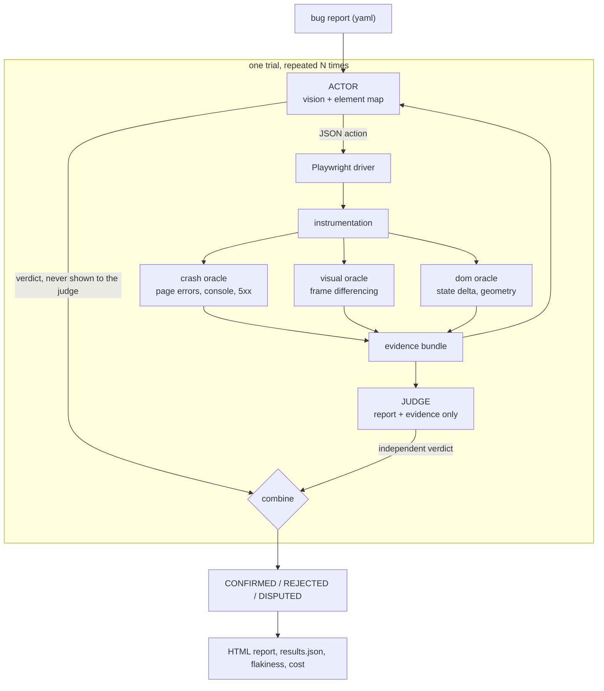

# ARBITER

**Automated Reproduction of Bugs with Independent Trial Evidence Review**

[](https://github.com/adwitiyashukla/ARBITER/actions/workflows/ci.yml)
[](LICENSE)
[](https://www.python.org/)

ARBITER reads a bug report written for a web application, drives a real browser to try to
reproduce it, and then has to convince a **separate model that never sees its reasoning** that
the evidence actually shows the reported symptom. A claim the judge cannot verify does not count.

Every run also repeats each report several times and reports how often it reproduced, so the
output is not "SUCCESS" but "reproduced in 3 of 3 attempts, judge confidence 0.9, 4.2 cents".

---

## The problem this addresses

LLM agents are good at following the steps in a bug report. They are much worse at telling you
whether the bug actually happened. The same model that performs the actions also grades its own
work, and it grades generously: it reaches the end of the reproduction steps without crashing and
declares victory. Published work in this area has had to audit its own results by hand and demote
a meaningful fraction of claimed successes, and a widely cited baseline turns out to have no
oracle at all, so it marks a step it cannot perform as missing and carries on regardless.

Manual auditing does not scale and it is not a property of the system. ARBITER makes the audit
architectural:

| | typical single-agent setup | ARBITER |
|---|---|---|
| who decides success | the agent that acted | a judge that did not act and cannot see the actor's reasoning |
| evidence | the agent's own narration | instrumented signals plus raw screenshots |
| repeatability | one run per bug | N trials per bug, with a reproduction rate |
| a bug report that is simply wrong | usually not tested | negative controls in the benchmark, measured as a false positive rate |
| cost | not reported | tokens and dollars per bug, from provider usage data |

---

## How it works



**The actor** sees each screen twice over: as a numbered element map (one line per visible
element, with flags and pixel boxes) and as the same screenshot with colour-coded boxes drawn on
it, so a number in the text points at something it can see. It replies with one JSON action from
a fixed vocabulary of 15. It is told explicitly that executing the steps is not the same as
observing the symptom, and that some reports in the set are wrong.

**The judge** receives the bug report, the list of actions that were executed with their results,
the objective signals recorded by instrumentation, the final page state, and up to four raw
screenshots chosen around the strongest signals. It does not receive the actor's reasoning, its
narration, or its verdict. It is told to be hard to convince and that INCONCLUSIVE is a legitimate
answer.

**The combination rule** is what makes the number honest:

| actor says | judge says | outcome | counts as a reproduction |
|---|---|---|---|
| REPRODUCED | REPRODUCED | `CONFIRMED` | yes |
| REPRODUCED | NOT_REPRODUCED | `REJECTED` | no, and the overclaim is counted |
| NOT_REPRODUCED | REPRODUCED | `DISPUTED` | no, surfaced for review |
| NOT_REPRODUCED | NOT_REPRODUCED | `AGREED_NOT_REPRODUCED` | no |
| anything | INCONCLUSIVE | `UNRESOLVED` | no |

### Judge isolation is enforced by a test, not by good intentions

`arbiter/judge.py` builds the judge payload through a function that is structurally incapable of
receiving the actor's conclusion, and `tests/test_judge_isolation.py` asserts both the signature
and the rendered text.

That test earned its place immediately. On the first run it failed: the actor's `finish` action
carries its verdict and its written reason as arguments, and the action log was being handed to
the judge verbatim. The independence claim had a hole in it on day one, found by a test rather
than by a reviewer. `finish` is now stripped from everything the judge sees.

---

## The three oracles

An oracle here never decides whether a report is reproduced. It reports machine-checkable facts.
The semantic step, does this evidence match what the reporter described, is the judge's job.

**Crash oracle.** Uncaught exceptions, `console.error`, failed requests and 5xx responses,
collected straight off the Playwright event stream.

**Visual oracle (`arbiter/oracle/visual.py`).** Around every action the driver captures a burst of
12 frames at roughly 80 ms, with a wall-clock stamp on each. Frames are converted to grayscale,
downscaled to 320 px wide, and reduced to a series of mean absolute differences. From that series:

- *no-op*: total change between the first and last frame below 0.002. Nothing happened. This is
  the negative-state oracle, and it is what catches a button that renders but does nothing.
- *stepped animation*: at least two moving frames, and the two busiest frames carry 60 percent or
  more of all pixel change, and fewer than half the frame pairs carry any motion at all. A smooth
  CSS transition spreads its change evenly across the burst and scores around 0.2 on
  concentration; a hand-rolled timer animation delivers everything in two or three jumps and
  scores above 0.8. This is the category that pure DOM-based tools cannot see, because the DOM is
  identical either way.
- *instant change*: exactly one moving frame. Deliberately **not** flagged as jank, because an
  un-animated UI update is not an animation bug. Getting this distinction wrong is the obvious way
  to build a jank detector that cries wolf, so it has its own test.
- *capture stall*: the gap between two captures blows past 250 ms, which means the page blocked
  the main thread.

**DOM oracle.** A readable diff of the element map before and after each action (added, removed,
text changed, value changed, enabled changed), plus geometric overlap detection for pinned
elements covering content, with ancestor and containment relationships excluded so a header
containing its own logo is not reported as covering it.

---

## The benchmark

Ten reports against ten small self-contained web apps, served from a local static server, so the
suite runs offline and cannot break because a third-party website changed. Each app has exactly
one seeded defect, and the agent never sees the app source: only the rendered DOM, screenshots
and the issue text. Seeded-defect benchmarks are the standard approach in this area, in the
tradition of Defects4J and BugsInPy.

| report | category | what is wrong | ground truth |
|---|---|---|---|
| `todo-crash` | crash | null dereference once the collection empties | bug |
| `modal-close` | unresponsive control | handler bound to the wrong node, X renders but does nothing | bug |
| `drawer-jank` | animation jank | hand-rolled timer animation that jumps and blocks the main thread | bug |
| `contact-residue` | state residue | typed fragment left behind next to the committed chip | bug |
| `export-disabled` | disabled control | wrong selector, four controls never become editable | bug |
| `stepper-skip` | logic | off-by-one, quantity jumps from 2 to 4 | bug |
| `double-submit` | race condition | no in-flight guard, a double click files twice | bug |
| `header-overlap` | responsive layout | hard-coded spacer under a header that wraps when narrow | bug |
| `search-filter-ok` | **negative control** | nothing. The filter is correctly case-insensitive | no bug |
| `theme-persist-ok` | **negative control** | nothing. Theme state survives the view change | no bug |

The two controls are the part most agent evaluations leave out. Their reports describe symptoms
that do not exist, and an agent that wants to please will find them anyway. Reproducing a control
is counted as a false positive.

Each report also names the real-world pattern it is modelled on, so the categories are not
invented: residual input text beside a contact chip, controls that are present but permanently
disabled, and a fixed header colliding with content at small widths are all shapes that recur in
real issue trackers.

---

## Results

<!-- RESULTS:START -->
_Populated by `python tools/inject_results.py` from `docs/results.json` after a live run, so
every number in this section is derived from run artifacts rather than typed by hand._
<!-- RESULTS:END -->

The full interactive report, including per-trial judge reasoning and the screenshots the judge
based its verdict on, is published from [`docs/`](docs/).

---

## Quickstart

```bash
git clone https://github.com/adwitiyashukla/ARBITER.git
cd ARBITER
pip install -r requirements.txt
python -m playwright install chromium

cp .env.example .env      # then paste a Gemini key from https://aistudio.google.com/apikey
```

Verify the machine before spending a single token. This drives three benchmark apps with scripted
actions and asserts that every oracle fires, no API key involved:

```bash
python -m arbiter smoke
```

Check the model wiring, then run the benchmark:

```bash
python -m arbiter check
python -m arbiter run --trials 3 --record
```

Useful flags:

| flag | effect |
|---|---|
| `--only todo-crash,drawer-jank` | run a subset |
| `--trials N` | repeats per report, this is what produces the flakiness score |
| `--headed` | watch the browser work |
| `--video` | record a webm of every trial |
| `--judge-model gemini-3.1-pro-preview` | a stronger and different judge, which strengthens independence |
| `--record` | write every model exchange to `traces/` for offline replay |
| `--provider mock` | replay `traces/` with no key and no network |

Actor and judge both default to `gemini-3.6-flash`, which is on Google's free tier. They are
separated by prompt, by role and by information: the judge cannot see what the actor thought.
Pointing `--judge-model` at a different model, or `--judge-provider` at a different vendor
entirely, makes that separation stronger, and the code path is identical.

## Reproducing a published run with no API key

`--record` writes every request and reply to `traces/`. Anyone can then replay the exact run:

```bash
python -m arbiter run --provider mock --trials 1
```

This is what CI does on every push, which means the pipeline is exercised end to end on a clean
machine without secrets, and a published result can be re-derived rather than taken on trust.

---

## Extending to other platforms

Everything above the driver is platform independent: the perception format, the action
vocabulary, all three oracles, the judge and the scoring. `arbiter/driver/base.py` is the entire
contract, five methods. A mobile implementation backed by adb and UIAutomator2 would supply an
element map with the same fields and a screenshot, and the rest of the stack would not change.
The frame-differencing oracle in particular is platform agnostic, since it only ever sees
grayscale arrays.

## Limitations

Stated plainly, because a results table without these is not worth much:

- **The benchmark is seeded, not scraped.** The defects are deliberately planted, which makes
  ground truth exact and the suite hermetic, and also makes it easier than the open world. It
  measures the pipeline, not the ceiling.
- **The judge is a language model.** It can be wrong in both directions. What ARBITER guarantees
  is independence and evidence-grounding, not infallibility. Running actor and judge on the same
  base model, as the free-tier default does, weakens independence further, and the fix is one flag.
- **Ten reports is a small benchmark.** The rates below have wide error bars. The infrastructure
  is built to scale to more cases, the cases themselves are the work.
- **No cross-origin or authentication flows.** Cross-app and OAuth journeys are out of scope, the
  same limitation the Android literature reports.
- **Cost figures use paid-tier rates** from the vendor's public pricing page, checked 2026-08-02,
  even when the run itself was made on the free tier. Token counts come from provider usage data
  and are exact; the dollar figure is what that traffic would cost if billed.

## Related work

- Feng and Chen, *Prompting Is All You Need: Automated Android Bug Replay with Large Language
  Models* (AdbGPT), ICSE 2024.
- Huang et al., *Crashtranslator / ReBL* line of work on LLM-driven Android bug reproduction,
  ISSTA 2024, which documents both the custom-view and non-crash oracle failure modes that
  motivated ARBITER's oracle design.
- Just et al., *Defects4J: A Database of Existing Faults to Enable Controlled Testing Studies for
  Java Programs*, ISSTA 2014, for the seeded-benchmark methodology.

## License

MIT. See [LICENSE](LICENSE).
